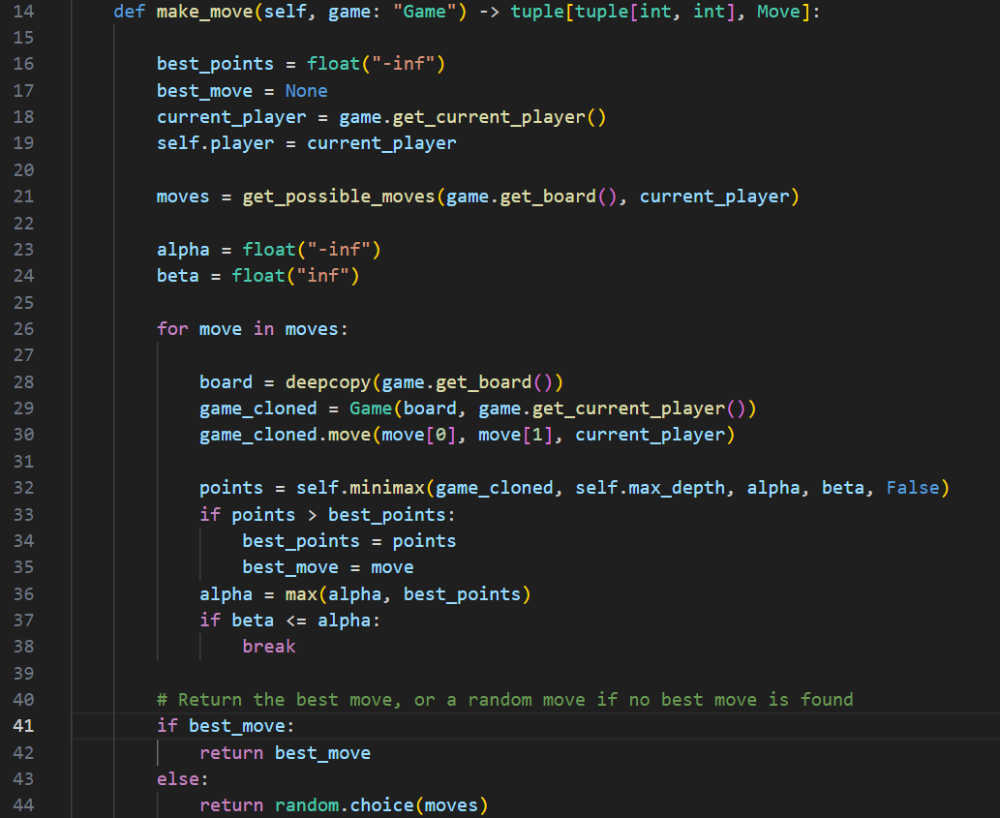
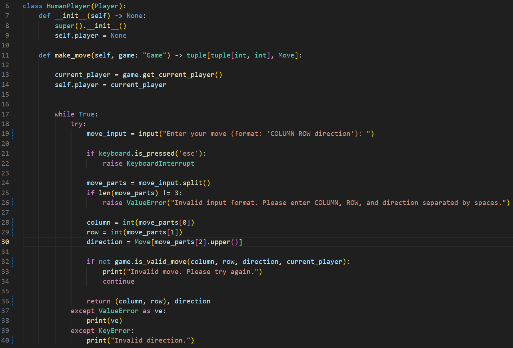

# QUIXO

This project implements an artificial intelligence based on the Minimax algorithm with Alpha-Beta pruning to play Quixo, a strategic board game.

## Minimax Player

### Introduction to the Minimax Algorithm:

The Minimax algorithm is a technique used in the field of artificial intelligence for finding optimal decisions in zero-sum games, such as chess, tic-tac-toe, or other board games. Its goal is to find the best move to make in a given game state.

The Minimax algorithm works by performing a layered search within the tree of possible moves, up to a certain depth. Specifically, the algorithm considers all possible moves available to the current player, then simulates the opponent's responses to each of these moves, and so on until reaching a certain depth in the tree of possible moves.

Once the maximum search depth is reached or the game is over (e.g., when one of the players wins or a draw occurs), the algorithm evaluates the final state of the game by assigning a score. This score is then propagated backward through the tree of moves to the root, using a principle of maximizing (Max) for the current player and minimizing (Min) for the opponent.

The Minimax algorithm aims to maximize the positive outcome for the current player and minimize the negative outcome for the opponent. This is achieved through a recursive evaluation of all possible game scenarios, taking into account the likelihood that the opponent chooses the best move in response to the current player's moves.

However, the Minimax algorithm can be computationally expensive as it explores the entire tree of possible moves, becoming impractical in games with a high number of possible moves or with a very large search depth. To mitigate this issue, a technique called pruning is often used, such as Alpha-Beta pruning, to cut off branches of the tree that do not affect the final outcome, thereby reducing the number of nodes to explore.

### Implementation:

The Minimax algorithm is implemented in Quixo through the *MiniMaxPlayer* class, which extends the *Player* class.  
This class includes 3 methods in addition to the constructor: the method to make a move *(make_move)*, the method to run the recursive algorithm *(minimax)*, and the method to evaluate a game state *(evaluate_state)*.

***make_move(self, game: "Game") -> tuple[tuple[int, int], Move]:***  
This method determines the best move for the current player using the Minimax algorithm with alpha-beta pruning. It calls the *minimax* function, which evaluates all possible moves recursively and returns the best calculated move.

***minimax(self, game, depth, alpha, beta, findingMax):***  
This method implements the Minimax algorithm with alpha-beta pruning. It evaluates all possible legal moves and selects the one that maximizes the advantage of the current player or minimizes the advantage of the opponent, depending on the turn. It uses alpha-beta pruning to eliminate unpromising branches in the search for the optimal move.

***evaluate_state(self, game):***  
This method evaluates the current state of the game and returns a score based on its convenience for the current player.  
In particular, it returns 5 if the current player has won, -5 if the opponent has won, and otherwise calls the get_intermediate_state_evaluation function to obtain an intermediate evaluation of the game state.

***get_intermediate_state_evaluation(self, game)***

To evaluate an intermediate state of the game, it is necessary to obtain an estimate in points of who is winning the game. To do this, the *get_intermediate_state_evaluation* method calculates, through the *find_max_sequence* method, the maximum (not contiguous) sequence of pieces (in vertical, horizontal, and both diagonals) for both players and evaluates the state as: *max_sequence_length_player - max_sequence_length_opponent*.

### Statistics

The Minimax Player has proven to be very skilled against Random:

For a more accurate and truthful analysis, the Minimax Player starts the first half of matches as second and the second half as first.

### Final Considerations

In Quixo, a Minimax Player is able to outperform a random player even with low algorithm depths like 2.

This is because even looking only a few moves ahead compared to an opponent who plays randomly allows you to ensure victory in most cases.

Unfortunately, it fails to reach 100% victory.

### Bonus

I have also implemented the ability to test your skills against AI or Random opponents, thanks to the *Human_Player* class which extends the *Player* class by overriding the *make_move* function.

The games use *Game2*, which is a class that extends *Game*, providing functions to clone the game state, print the board with X and O instead of 1 and 0, and play interactively against other players, both as the first and second player.

