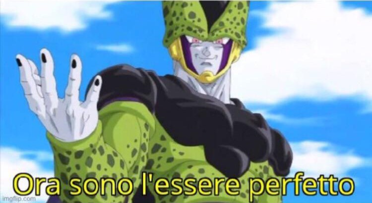
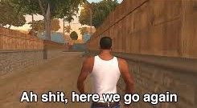
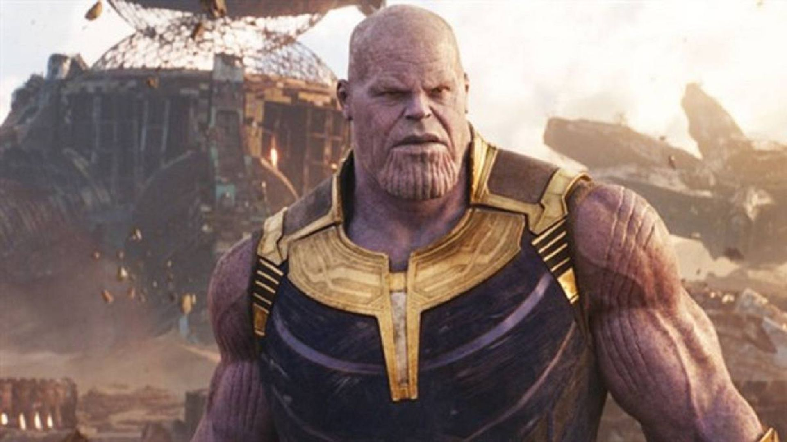

# Lab 4

**N.B.**  
I don't know if it's an official rule of the game, but we assumed that X always moves first. This information can be useful as a key for interpretation and understanding of some experiments.

# Objectives
For the resolution of this laboratory, we started from the professor's strategy and tried to improve it, testing how artificial intelligence behaved in different scenarios.

# Experiments conducted

## IA muoves first ( X )

As we started, we focused on implementing the training model into the algorithm of an AI-controlled player.   
The underlying idea is that a player should be able to find the best move for each position.  
The algorithm we implemented leverages the knowledge of all states acquired during the training phase to find the best move for each state.  
Of course, the effectiveness of this solution depends on the success of the training session. With a sufficient number of games during the training phase, for a simple game like tic-tac-toe, we can assume to have visited all possible states multiple times, thus having an optimal dictionary capable of suggesting the best move in every situation.  
The training games use random moves to try to explore as many states and as many times as possible.

After implementing this algorithm, we wondered how good this player actually was.  
Then we put it to the test in a series of 1000 games against a player who moves randomly, obtaining excellent results:

Statistics against the random player over 1000 games (Using X):  
Wins: 995  
Loss: 0  
Draws: 5

From these results, we can assume that the AI has reached the highest possible level and (with the X) plays perfectly.

But winning doesn't necessarily mean making the best moves.  
So, to be sure that it didn't make mistakes, we implemented the function that prints move by move the various states of a single game.  
The tests performed, showed that every time the AI had the opportunity to win, it closed the game, confirming our hypothesis that it had now reached perfection.

It may seem obvious, but it's not. With a low number of games during training, it could happen that, not exploring all possible combinations of moves sufficiently, it chose non-optimal moves while still winning. This happened to us with a number of games in the training phase equal to 100.000, prompting us to opt for a greater number of games, equal to 500.000 .

## IA moves second ( O )

After achieving this result, we wondered how the AI would behave if it had to use O and move second.

Initially, we adapted the algorithm that selects intelligent moves to find the best moves for O.  
Instead of choosing the move that led us to the best state for X, we selected moves that led us to the worst state, therefore more advantageous for O.  
Although it played quite decently, it tied and lost a bit too much. Starting second, when X plays well, if you are skilled, you can manage to draw. Therefore, we were not concerned about the number of draws, but there were too many losses for it to be considered a good AI.

In addition, the training (for X) stored and updated the state value based on how advantageous it was for X, also considering the difference between the final result of the game and the value of that state up to that point.  
Therefore, it didn't fit perfectly to our case.  
Then we decided to create a training program exclusively for O, with a dictionary that learns the best moves in every situation and that could, at least, draw even against the best opponents.

### Training for O: Phase 1

The training principle was the same as for X.  
The initial results were not very satisfying. We managed to reduce the losses a bit, but the AI was still far from being a very good player.

The major weakness come out when we tried to make this AI play against the one that plays perfectly with X.  
The 1000 test games ended with a score of 1000 to 0 for X.  
This experiment highlighted how O did not know the strategy to draw against a perfect X. This is because, in the 500,000 randomly played training games, the times the computer randomly plays the best moves for X and O's best moves to draw are too few, or not highly valued enough, for O to learn and memorize the optimal defensive strategy in its dictionary.

Thus we started the phase 2 of training for O...

### Training for O: Phase 2

If Mohammed will not go to the mountain, the mountain must come to Mohammed...

Since O, during the training phase, did not have the opportunity to learn the defensive strategy against the perfect X, we designed a phase 2 of the training where we exclusively trained our AI against the perfect X, taking care to record the results and update the relevant states in O's dictionary.

During this second training phase, the AI, moving randomly during these games, had the opportunity to draw and discover the ideal defensive strategy against X and memorize it.

To ensure that once it drew, it wouldn't forget how it had done it, we introduced a second reward function, different from the one used during phase 1, which would reward draws more significantly.

Passed this second training phase, O challenged X in search of its revenge.

This second time, things went a bit differently...

Statistics AI vs AI:  
Wins X: 0  
Loss X: 0  
Draws: 1000

O managed to draw all the games, demonstrating that it had learned the defensive strategy against X's best moves, and therefore, the training was a success.

Having overcome this obstacle, there still remained the issue of losses. Ideally, it should be able to draw every game, insted of having consistently a 12% rate of losses.

Also in this case, we made sure to verify that in games won by O, it used the best moves. Therefore, we implemented the function that prints move by move the various states of a single game.  
Then we checked that it knew the best moves.

It reamained to understand why it continued to lose some games.  
We gave ourselves the explanation that during the phase 1 of training, it couldn't explore all possible states in dept or couldn't face enough those few games it lost to memorize the counter-moves.

Thus we designed the third phase of the training.

### Training for O: Phase 3

Following the same approach as in phase 2, we saved the games that O lost in data structures and then replaying them during the third phase of training to update its dictionary more accurately with the best moves for each state.

We implemented the new reward function and the function to play against predefined sequences of moves.  
It is impossible to make O replay the exact same games it lost since O moves randomly. However, over a large number of games, it is likely to replay similar or identical games, hoping to win them and memorize the winning moves.

Then we stared the third phase of training.

As a result, the losses decreased to approximately 4%, but they were still present.  
Therefore the third phase of training did not achieve the desired goal.

**P.S.**  
Afterwards, we conducted further tests, focusing our efforts on the training parameters, like *epsilon* and the *reward* in case of victory, draw, or defeat.  
Surprisingly, by trying various values of epsilon and slightly adjusting the rewards, we achieved the lowest recorded result: 0.3% losses.

Moreover, with these new parameters, there was no need for the phase 2 to manage to draw against an AI-controlled X. The phase 3, with these parameters, proved to be only detrimental, worsening the performance.

At this point we suppose phases 2 and 3 may not be very useful, but they were still nice experiments from an instructive and recreational perspective.

## *Intelligent* Trainig

As a last experiment, we tried a different strategy during the training phase.  
Until now, during the training phase, games were played randomly. We wondered, whether or not, it would be a good idea to leverage the knowledge acquired up to that point already during the training phase.

Statistics against the random player over 1000 games (Using X):  
Wins: 654  
Loss: 277  
Draws: 69  

The results were a bit disappointing.  
This is because, being influenced right from the start by the acquired knowledge, the AI fails to explore in dept all possible moves or tends to focus only on certain paths it believes might be winning, possibly ignoring other better paths.

## Challenge the AIs!

After finishing our experiments, we thought it could be fun to challenge ourselves against the AIs we created.

They are unbeatable...

The few combinations that O fails to block are so rare and suboptimal that any human player would never play them, effectively being unable to beat the AIs (both with X and O) ever!

The AIs right now:
